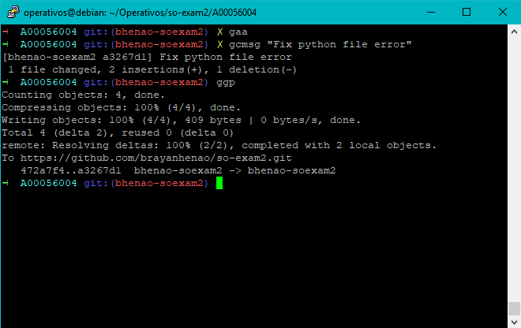
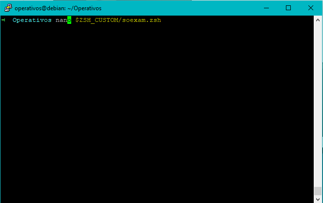
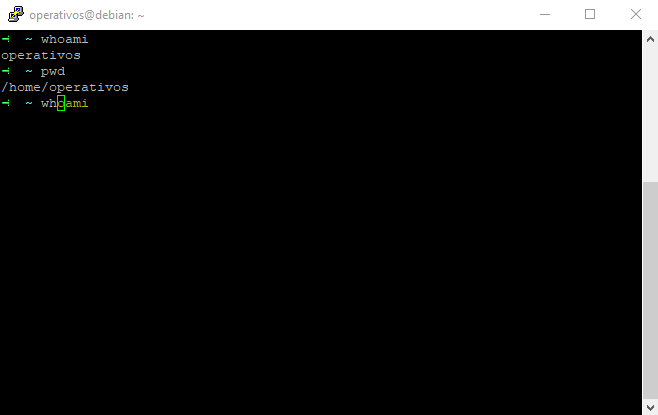
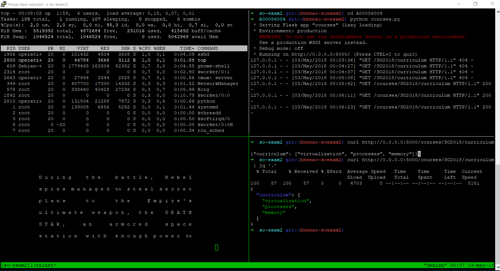
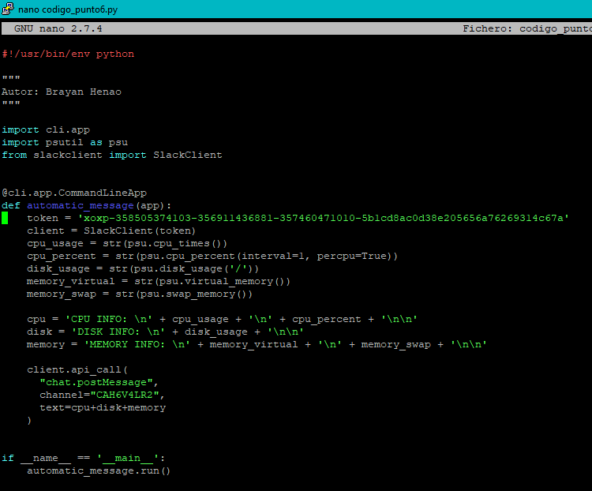
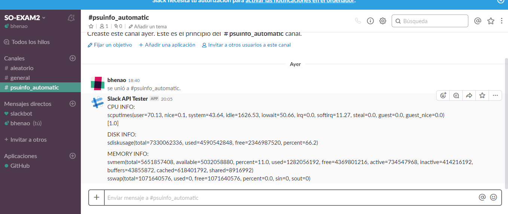

# Sistemas Operacionales - Parcial 2
**Nombre:** Brayan Andrés Henao  
**Código:** A00056004  
**Correo:** bryanhenao96@gmail.com  
**URL Repositorio:** https://github.com/brayanhenao/so-exam2
___

## Instalación y configuración de zsh y git
Para la instalación y configuración de zsh y sus plugins se siguen los siguientes pasos:
Los comandos utilizados para la instalación mediante apt-get requieren permisos de usuario root (sudo) por lo que se tiene como prerequisito que el usuario sea sudoer o ya se esté como root en la terminal al momento de ejecutar el comando.

1- Se instala zsh con el siguiente comando:
```console
apt-get install zsh
```

2- Una vez instalado zsh, cambiamos al usuario operativos previamente creado, exportamos una nueva variable de entorno para asegurarnos de no instalar zsh en el directorio root y se hace un llamado curl para terminar la instalación. Se utilizan los siguientes comandos en el orden explicado previamente:
```console
su operativos
export ZSH="$HOME/.dotfiles/oh-my-zsh"
sh -c "$(curl -fsSL https://raw.githubusercontent.com/robbyrussell/oh-my-zsh/master/tools/install.sh)"
```
Pdta: Si no se tiene curl, se instala con el siguiente comando:
```console
apt-get install curl
```

3- Para configurar el accesso a git mediante un token personal, se utiliza el siguiente comando:
```console
git config remote.origin.url "https://adcb1c21ecf5f0416ad135dc1814c76f9554d97f@github.com/brayanhenao/so-exam2.git"
```

En esa captura se aprecia el uso de zsh con git, mediante el llamado de gaa, gcmsg, ggp:




## Instalación y configuración plugin zsh-autosuggestions

1- Se instala el plugin con el siguiente comando, el cual clona el repositorio del plugin al directorio de zsh:
```console
git clone https://github.com/zsh-users/zsh-autosuggestions $ZSH_CUSTOM/plugins/zsh-autosuggestions
```

2- Una vez instalado, se debe adicionar al archivo de configuración de zsh con un editor de texto la siguiente línea:
```console
nano ~/.zshrc
plugins=(git zsh-autosuggestions)
source ~/.zshrc
```

3- Para configurar finalmente el color subrayado en el autocompltado, se crea el siguiente archivo y se adiciona una línea con el nuevo color:
```console
nano $ZSH_CUSTOM/soexam.zsh
export ZSH_AUTOSUGGEST_HIGHLIGHT_STYLE="fg=yellow"
source ~/.zshrc
```

Ahora verificamos que los cambios del color fueron exitosos mediante estas dos capturas donde se muestra el autocompletado de comandos:





## Instalación y configuración de Tmux

1- Se instala Tmux utilizando el siguiente comando:
```console
apt-get install tmux
```
2- Para configurar los keybinds de Tmux se modifica el siguiente archivo:
```console
nano ~/.tmux.conf
```
Agregando estas líneas
```
# use C-a, since it's on the home row and easier to hit than C-b
set-option -g prefix C-a
unbind-key C-a
bind-key C-a send-prefix
set -g base-index 1

# Easy config reload
bind-key R source-file ~/.tmux.conf \; display-message "tmux.conf reloaded."

# vi is good
setw -g mode-keys vi

# Setup 'v' to begin selection as in Vim
bind-key -Tcopy-mode-vi v send -X begin-selection
```
Una vez realiazo estos pasos ya tendremos Tmux configurado con los keybinds personalizados.

En este video se aprecia el uso del anterior punto:
[](https://asciinema.org/a/179538)

## Crear sesión en Tmux y separar pantalla en cuatro partes
1- Se crea una sesión en Tmux de nombre so-exam2 con el siguiente comando:
```console
tmux new-session -s so-exam2
```

2- Una vez creada la sesión, se procede a dividir la pantalla en cuatro cuadrantes, esto se hace mediante el atajo de teclado que creamos previamente:
```
Ctrl + a + %   -> Divide la pantalla verticalmente
Ctrl + a + "   -> Divide la pantalla horizontalmente
```

En esta imagen se aprecia la pantalla dividia ejecutando los comandos requeridos:



## Aplicación programada conectada con Slack
Esta aplicación requiere ciertas librerías para su usto, estas son instaladas mediante el gestionador de paquetes de python "pip", los siguientes comandos son para instalar estas librerías:

**Slack client**
```console
pip install slackclient
```
**Python CLI**
```console
pip install pyCLI
```

**psutil**
```console
pip install psutil==4.3.0
```

### Creación del script
Una vez realiazada la instalación de estas librerías, se procede a crear el script de python con nombre **codigo_punto6.py**. Se utiliza como base los ejemplos propuestos en [pyCLI](https://pythonhosted.org/pyCLI/), [psutil](https://pypi.python.org/pypi/psutil/4.3.0) y [Slack client](https://github.com/slackapi/python-slackclient) para crear este script:




Una vez realizo el script, se prueba mediante el comando:

```console
python codigo_punto6.py
```

Y se verifica que este se encuentra funcionando, revisando el canal de slack como se aprecia en esta imagen:




### Programar la ejecución del script
Para programar la ejecución díaria a las 08:00 AM todos los días del script previamente realizado, se utiliza el siguiente comando:

```console
crontab -e
```

El cual nos abre un editor de texto en el que debemos agregar la siguiente línea, que indica que será una tarea programada todos los días a las 08:00 AM:
```
0 8 * * * /usr/bin/python /home/operativos/Operativos/so-exam2/A00056004/codigo_punto6.py
```


